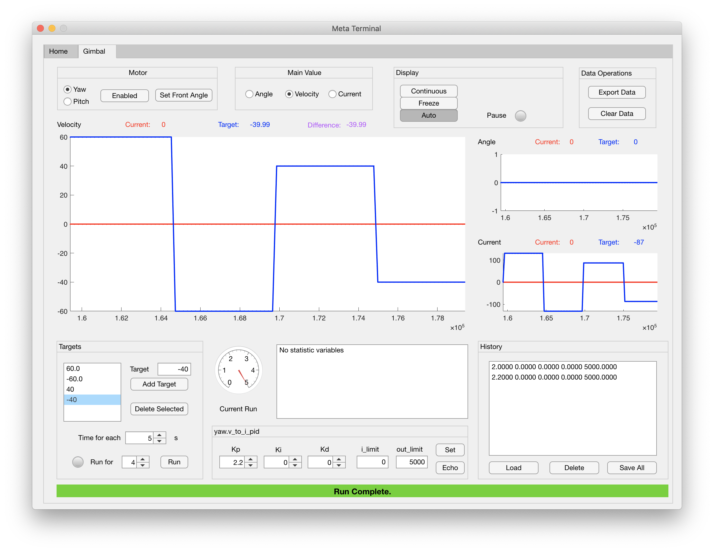

# Meta Terminal

MATLAB App for program control through shell.

## Gimbal Control

## Note
* Design for GimbalController Unit Test.
* Change main value will change the layout of plots and __PID controller__. You can only set one PID at a time, but params are stored both locally and remotely (see next.)
* PID params and history is store __locally__ for __each__ motor and __each__ PID. But if the terminal is restarted, the stored values may not equals to those set in the program. You can check those set in the program by "Echo" command.
* When controlling velocity, only v_to_i_pid is enabled. When controlling angle, both angle_to_v_pid and v_to_i_pid are enabled.
* GimbalController Unit Test will detect exceeded __actual__ angle, __actual__ velocity and __target__ current and disable corresponding motors. This will also interupt current running.
* Auto display mode is make for running function. Plot get updated only at running, and show the period from first target to last target.
* Each target will run for given time, and then switch to next target. Motors are not disabled during the whole period, but only target values change.

