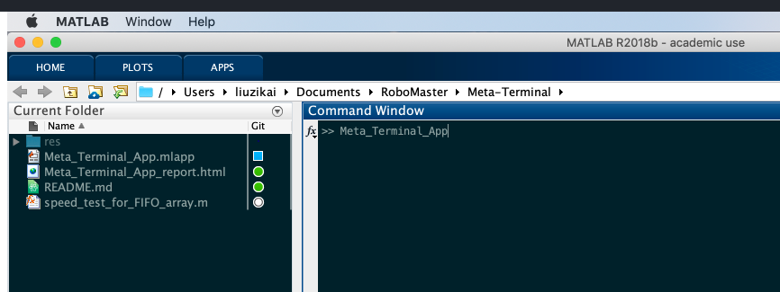
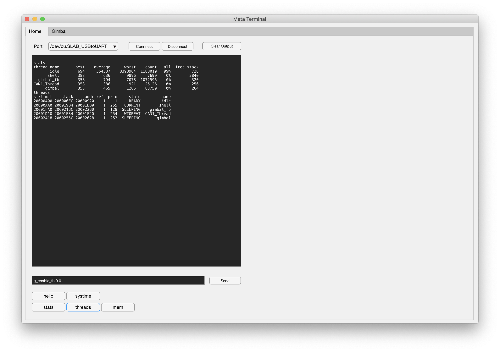
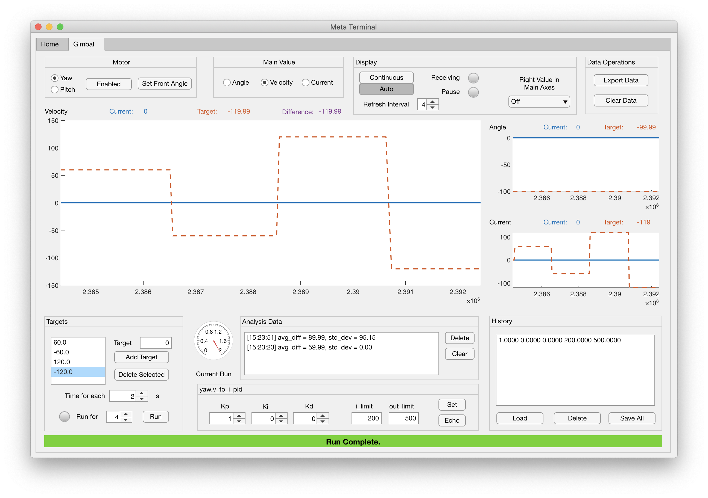

# Meta Terminal

这是一个使用 MATLAB AppDesigner 设计的 PC 端调试程序，通过串口 Shell 与嵌入式程序交互。

## Usage
使用 MATLAB 打开**整个目录**，双击右侧 Meta_Terminal_App.mlapp 文件或在命令窗口输入 Meta_Terminal_App。

注意：不可直接将 Meta_Terminal_App.mlapp 文件拖入命令窗口。

## Home Tab

* Port 选择串口
    * /dev/cu.SLAB_USBtoUART 为 Mac 下 CP2102 模块串口
    * /dev/cu.HC-05-DevB 为 Mac 下 HC05 蓝牙模块串口
    * COM1 - COM9 为 Win 下串口
* Connnect 连接，Disconnect 断开连接，Clear Output 清空终端显示
* Send 发送指令
* 下方按钮为 Shell 指令，参考嵌入式程序 Shell

PS: 回传数据与普通数据共用串口通道，在使用普通串口时，可能会与回传数据混杂。

## Gimbal Control

## Note
* 基本思路：每次调节一个电机（Yaw/Pitch），控制一个值（Main Value，角度/角速度/电流）。
    * 控制角度时，对应调节的 PID 为 angle_to_v_pid（v_to_i_pid 同时生效），对应 GimbalController Unit Test 程序
    * 控制角速度时，对应调节的 PID 为 v_to_i_pid（angle_to_v_pid 不生效），对应 GimbalController Unit Test 程序
    * 控制电流时，无 PID 调节，对应 GimbalInterface Unit Test 程序
* Set Front Angle 是电机基准角度校准，在电机 Disabled 的情况下摆正云台，点击 Set Front Angle，会以当前实际角度作为基准角度。
* 关于目标值 (Targets) 的基本思路：每一次运行（Run）中包含一定数量的（Run for X）目标值（Target），每个目标值只持续给定的时间（Time for each）。时间结束后切换到下一个目标（如果到了列表结尾，从头开始），当最后一个目标结束后，电机设为 Disabled。
* GimbalController Unit Test 程序内嵌保护，Running 过程中，如果达到了最大**实际**角度、**实际**转速、**目标**电流，则触发保护机制，电机 Disabled，本次运行中断。
* 显示模式：
    * Continuous 连续模式，显示最近 X 秒。
    * Auto 自动模式，当没有 Target 在运行时，图表不更新（但 Current 和 Target 标签依然更新，Receiving 灯闪烁），当开始一次 Run 的时候，图表以 Run 的时刻为起点，以最后一个 Target 结束为终点。
    * Refresh Interval 刷新间隔，每收到 X 个回传数据，刷新一次图表和统计值。该值由 PC 性能决定，刷新间隔过小可能并不能提高显示的流畅度。
    * Main Axes Right Value 主图表窗右 Y 轴显示，可从 实际/目标 角度/角速度/电流 六个值中选取。注意：Auto 模式下绘图暂停（Pause）时修改该参数无效，重新开始运行后才生效。
    * Analysis Data，当前窗口中显示的所有数据的统计，最上面一条为当前/最后一次运行的统计值
    * avg_diff，平均误差的绝对值
    * std_dev 是标准差
* 目标值列表、PID 参数、History 列表和各个电机、各个 Main Value 相关联，并保存在程序中，直到退出程序前都有效。在切换电机或 Main Value 时，以上内容也会对应变化，但不会丢失。但退出程序前请保存！
* 值得一提的是，开发板中已经设置的 PID 参数和程序中保存的参数可能不同，可使用 Echo 指令让开发板程序回传当前参数。
* 如果遇到程序卡死，尝试以下操作：
    * 回到 Home 标签页，Disconnect，Connect
    * 使用 Clear Data 清空历史数据
    * 重启串口和开发版

# Update History

## 2019.1.4 V1.0
初次版本。

## 2019.1.10 V2.0
大幅重构云台调参功能

## 2019.1.13 V2.1
* 增加了数据分析。
* 增加了主图表窗右 Y 轴显示。
* 优化性能，相应的在 GimbalController Unit Test 中将反馈间隔缩小至 150ms，只回传当前电机信息。
* 在 GimbalController Unit Test 中拓展了角度、速度、电流的限制范围。
* 更改了图表配色，使用虚线显示目标值。
* 其他小的优化与 Bug 修复。

## 2019.1.16 V2.2
* 优化核心代码，大幅提升数据处理速度，现已支持 50 ms 回传（提升了66.7%！）
* 增加数据纠错，提升稳定性
* 增加刷新率设置
* 其他小的优化与 Bug 修复。

## 2019.1.17 V2.2.1
* 更改反馈速度至 25 ms
* 小幅减小回传数据与普通信息混杂的可能性。